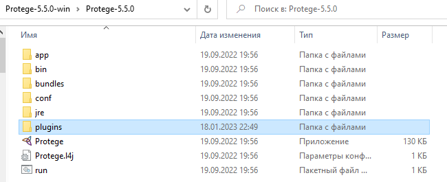
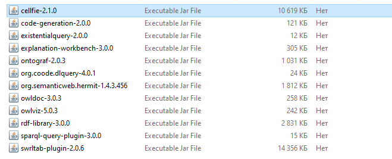
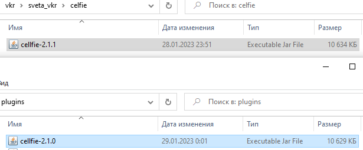
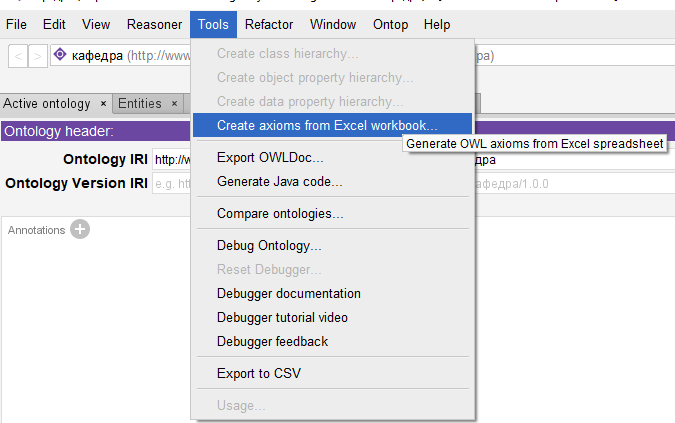
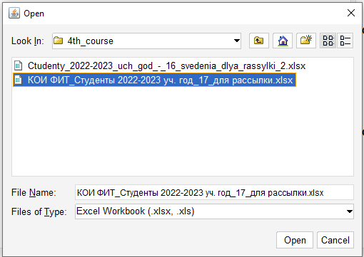
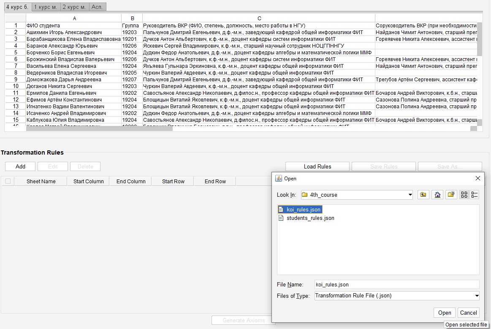
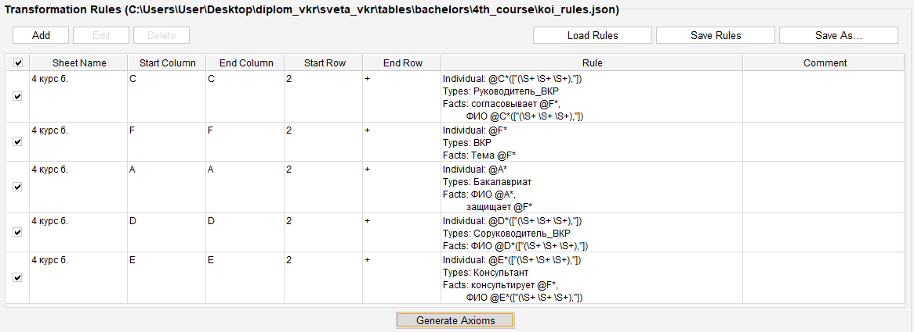
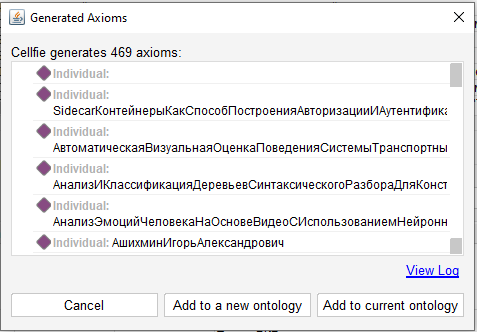

# Для того, чтобы сгенерировать данные о студентах в Protege, необходимо выполнить следующие шаги
### 1. Установка и использование Protege
 1.1. Для того, чтобы скачать Protege, нужно перейти по ссылке: _https://protege.stanford.edu/products.php_
 
 1.2. После успешной установки, необходимо заменить в папке плагина celfie для Protege .jar файл на тот, что расположен в проекте (celfie/celfie-2.1.1.jar)

_**Для подробной информации приведены скриншоты ниже**_

1. Переходим в папку plugins

2. Подменяем выделенный файл

 

3. На тот, что расположен в проекте

_Данное действие было сделано с целью использования русского языка в приложении в процессе работы с правилами и элементами онтологии._
 
1.3. Запускаем Protege и работаем с онтологиями

### 2. Открыть файл _rules.owl_ в Protege
_Данный файл расположен в корне проекта._
### 3. Загрузить таблицу с данными о научных руководителях 
_(см. пункт **"Таблицы и правила"**)._
1. Во вкладке Tools, расположенной в верхнем меню, выбрать пункт _**Create axioms from Excel workbook**_ _(см. скриншот)_

   

2. Выбираем нужную таблицу и нажимаем _**Open**_ _(см. скриншот)_

   

3. Выбираем _**Load Rules**_ и загружаем правила для этой таблицы, после нажимаем _**Open**_ _(см. скриншот)_
   
   

4. После того как загрузили правила, нужно сгенерировать аксиомы 

Для этого нажимаем _**Generate Axioms**_ _(см. скриншот)._

   

5. Если ошибок при генерации нет, появится окошко _(см. скриншот)_, где нужно выбрать _**Add to current onlotogy**_
   
   

### 4. Повторяем действия из пункта 3 для второй таблицы
### 5. Сохраняем файл в формате rdf и помещаем его в корень проекта с именем _main_students_all.owl_

## Таблицы и правила

 1) Сначала выгрузите таблицу Студенты 2022-2023 уч.год.xlsx и загрузите правила, согласно описанию ниже.
 2) После - Студенты 2022-2023 уч.год_2.xlsx и правила для нее.

Файлы, описанные в таблице, расположены по пути _**src/main/resources/rules**_.

| _Наименование таблицы_           | _Файлы с правилами_                                                                                 |
|----------------------------------|-----------------------------------------------------------------------------------------------------|
| Студенты 2022-2023 уч.год.xlsx   | students_rules_main.json - для бакалавров   students_rules_masters_main.json - для магистрантов             |
| Студенты 2022-2023 уч.год_2.xlsx | koi_rules_main.json - для бакалавров  koi_rules_masters_main.json - для магистрантов|

### 6. Генерация пакета документов  
В классе StudentsQuery.java в строке 22 содержимое меняется в зависимости от того пакета документов, который нужно породить.
В файле Degree.java в зависимости от направления выбирается строчка 9 или 10 (строка 9 для "Технология разработки программных систем", строка 10 - для "Технология разработки программных систем". Для направления"Программная инженерия и компьютерные науки"документы генерируются в любом случае).
1. FILTER regex(?профиль, "Компьютерное моделирование и анализ данных")
2. FILTER regex(?профиль, "Программная инженерия и компьютерные науки")
3. FILTER regex(?профиль, "Технология разработки программных систем")
   

 