# Для того, чтобы сгенерировать данные о студентах в Protege, необходимо выполнить следующие шаги
### 1. Установка и использование Protege
 1.1. Для того, чтобы скачать Protege, нужно перейти по ссылке: _https://protege.stanford.edu/products.php_
 
 1.2. После успешной установки, необходимо заменить в папке плагина cellfie для Protege .jar файл на тот, что расположен в проекте (cellfie/cellfie-2.1.1.jar)

_**Для подробной информации приведены скриншоты ниже**_

1. Переходим в папку plugins

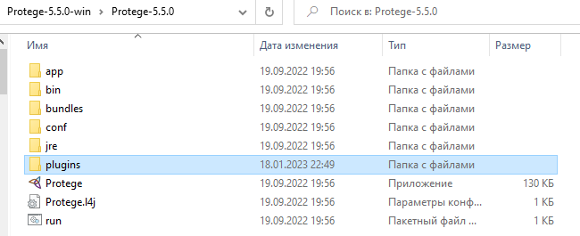

2. Подменяем выделенный файл

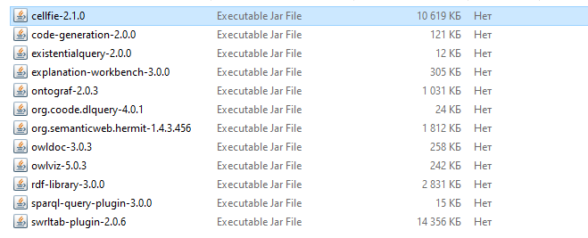 

3. На тот, что расположен в проекте

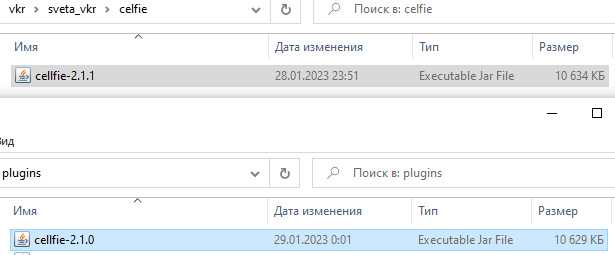

_Данное действие было сделано с целью использования символов кавычек и скобок при импортировании таблиц Excel._
 
1.3. Запускаем Protege и работаем с онтологиями

### 2. Открыть файл _rules.owl_ в Protege
_Данный файл расположен в корне проекта._
### 3. Загрузить таблицу с данными о научных руководителях 
_(см. пункт **"Таблицы и правила"**)._
1. Во вкладке Tools, расположенной в верхнем меню, выбрать пункт _**Create axioms from Excel workbook**_ _(см. скриншот)_

   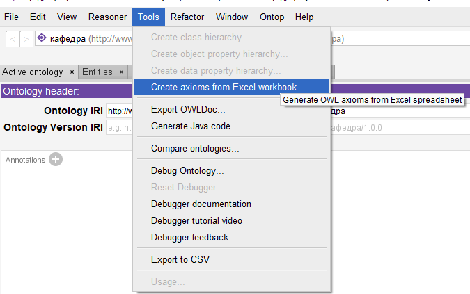

2. Выбираем нужную таблицу и нажимаем _**Open**_ _(см. скриншот)_

   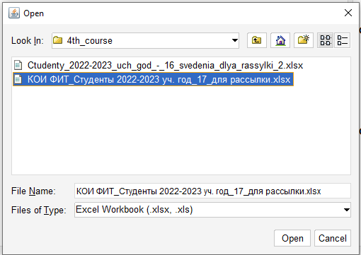

3. Выбираем _**Load Rules**_ и загружаем правила для этой таблицы, после нажимаем _**Open**_ _(см. скриншот)_
   
   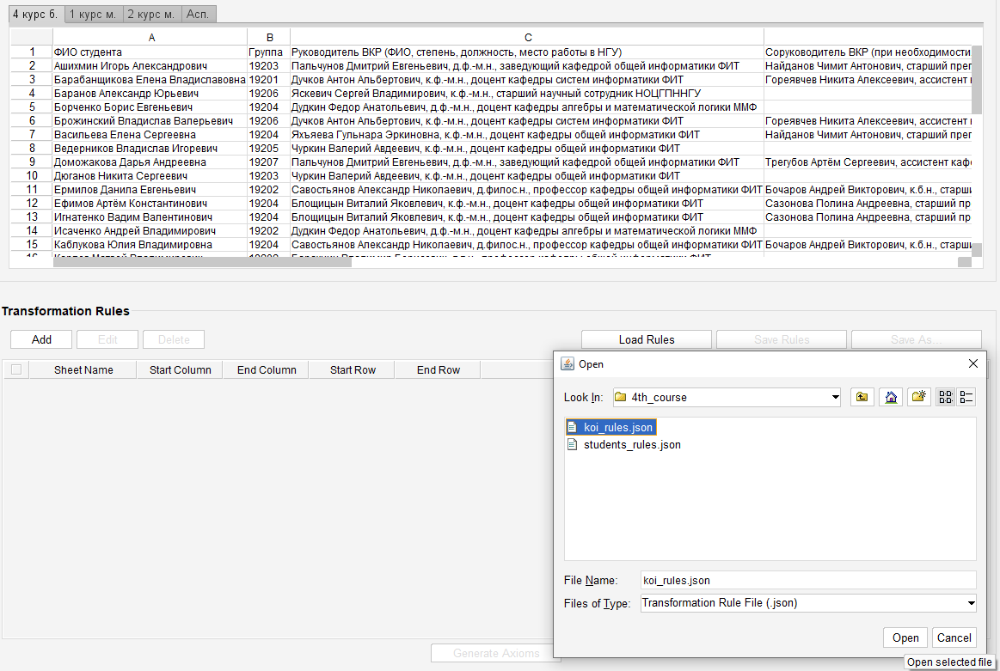

4. После того как загрузили правила, нужно сгенерировать аксиомы 

Для этого нажимаем _**Generate Axioms**_ _(см. скриншот)._

   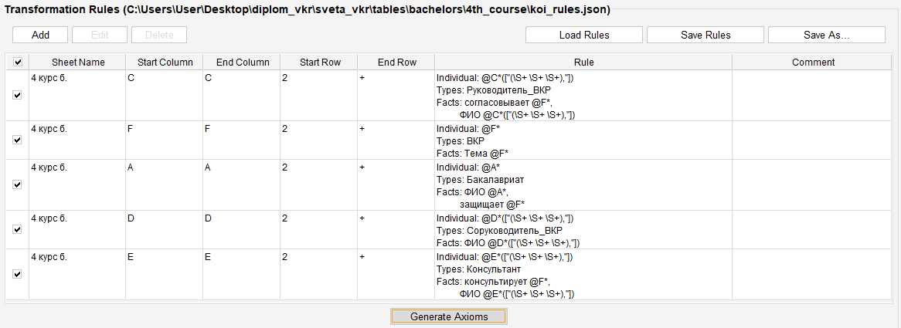

5. Если ошибок при генерации нет, появится окошко _(см. скриншот)_, где нужно выбрать _**Add to current onlotogy**_
   
   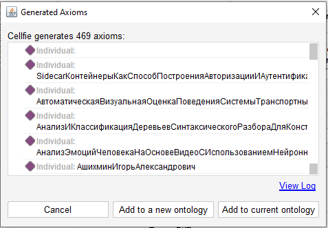

### 4. Повторяем действия из пункта 3 для второй таблицы
### 5. Сохраняем файл в формате rdf и помещаем его в корень проекта с именем _main_students_all.owl_

## Таблицы и правила

 1) Сначала выгрузите таблицу Студенты 2022-2023 уч.год.xlsx и загрузите правила, согласно описанию ниже.
 2) После - Студенты 2022-2023 уч.год_2.xlsx и правила для нее.

Файлы, описанные в таблице, расположены по пути _**src/main/resources/rules**_.

| _Наименование таблицы_           | _Файлы с правилами_                                                                                 |
|----------------------------------|-----------------------------------------------------------------------------------------------------|
| Студенты 2022-2023 уч.год.xlsx   | students_rules_main.json - для бакалавров   students_rules_masters_main.json - для магистрантов             |
| Студенты 2022-2023 уч.год_2.xlsx | koi_rules_main.json - для бакалавров  koi_rules_masters_main.json - для магистрантов|

### 6. Генерация пакета документов  
На интерфейсе нужно выбрать документы, которые хотите заполнить (_*см.скриншот*_)
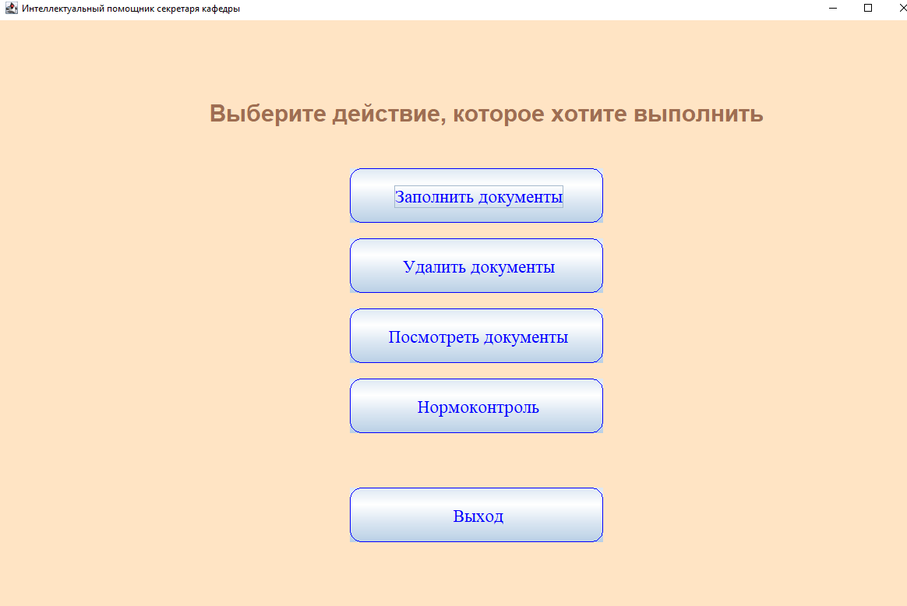
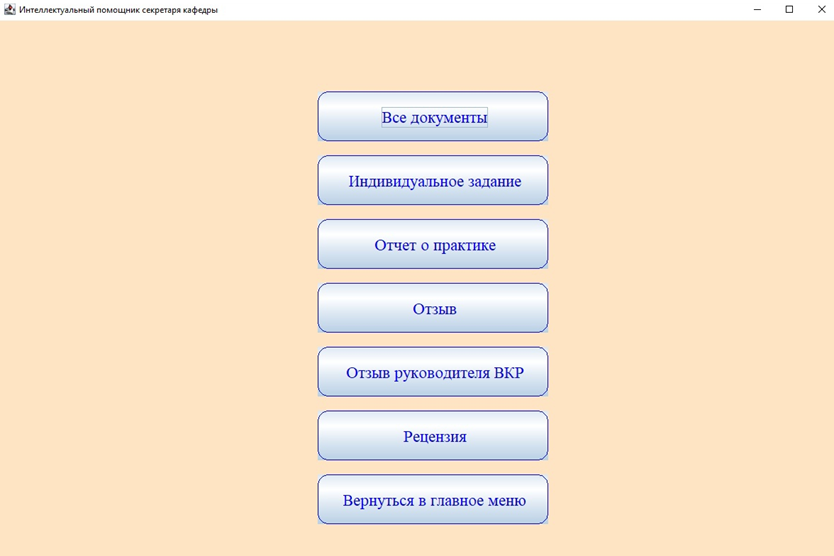
   

### 7. Нормоконтроль
1) Требования по нормоконтролю описаны в онтологии (__*src/main/resources/normocontrol.owl*__). В случае, если загружается или обновляется онтология  нужно взять за основу файлы для выгрузки данных в новую онтологию (__*src/main/resources/rules/main_rules.owl*__ и __*src/main/resources/normocontrol.owl*__) и загрузить их в Protege, далее проделав пункты выше по наполнению базы знаний.
2) Необходимо установить пакеты python для корректного запуска скрипта. Для этого необходимо выполнить команды:
__*pip install nltk*__
__*python -m nltk.downloader punkt*__
__*python -m nltk.downloader stopwords*__

3) Валидация отчета и индивидуального задания осуществляется в двух режимах - через интерфейс, а также в ручном формате.
4) На интерфейсе представлены кнопки для валидации индивидуального задания и отчета (см. скриншот). По нажатию на соответсвующее направление будет осуществлена валидация отчета и индивидуального задания.
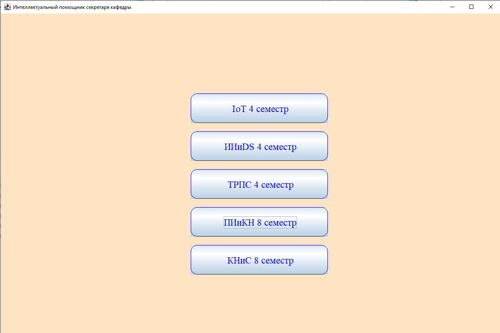
5) В ручном формате выбирается класс, совпадающий с названием файла для валидации. Классы расположены в пакете: **_src/main/java/normative_control/validation/runners_**. После перехода необходимо выбрать директорию с уровнем подготовки, далее - с направлением обучения.
6) Логи об успехе/неудаче нормоконтроля документов можно увидеть в консоли, а также в файлах, которые будет сгенерированы по окончанию валидации (**_файлы будут расположены в корне проекта_**).

 